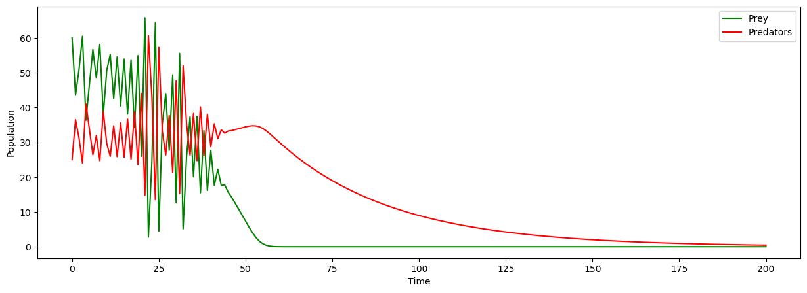

# Population dynamics

[](https://github.com/artificial-life-lab/population-dynamics/raw/master/LICENSE)
[](https://pypi.org/project/causal-inference-population-dynamics)
[](https://codecov.io/gh/artificial-life-lab/population-dynamics)

Library to conduct experiements on population dynamics.



## Installation

1. To generate required log and results directories, run

```(bash)
bash init.sh
```

2. Create conda environment

```(bash)
conda env create -f environment.yml
```

3. Activate the environment

```(bash)
conda activate population-dynamics
```

4. Install `causal` as a package within the environment

```(bash)
python setup.py develop
```

## Running the Lotka-Volterra simulation

- The Lotka-Volterra simulator class exists in `repo/causal/base/lotka_volterra.py`.
- The Lotka-Volterra simulation parameters are fetched from `repo/causal/config.py`.
You can edit the `config.py` file directly to play around with the parameter values.

- You can run the simulator directly from terminal by running

```(bash)
python causal/base/lotka_volterra.py
```

- The simulation statistics will be saved in the `repo/results` directory.
